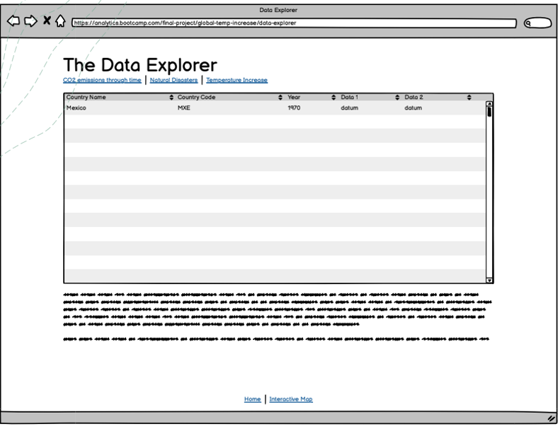

# final_project_global_warming
Data Analytics Bootcamp - Final Project - Team Global Warming

## Selected topic 
The cost of weather increase and natural disasters- worldwide view
 Keywords: Earth temperature – natural disasters - cost

The following link address slides with the following information: 
[slides](https://docs.google.com/presentation/d/1NoE9vUd6RThqdDHh4d1OVyLSLFeM9awF/edit?usp=sharing&ouid=114301235931032176624&rtpof=true&sd=true) 

## Reason why we selected the topic 

The weather seems to behave lately in an erratic and new way that we are yet to understand.
Extreme temperatures and natural disasters might impact huge populations and world economic sectors.
A variety of aspects need to be taken into consideration with this new weather behavior (individually and business/enterprise wise). 

In the following project, we want to try at the very least to provide a clearer understanding of available data and identify statistically significant variables that might be implicated in this complex and evolving worldwide situation. This may provide light and hopefully offer not only information but also point to a model that may be the stepping stone of decision-making for different enterprises or sectors. 

## Project Outline
- Objective 
We want to analyze and understand if global warming reflected as temperature change may influence the occurrence of natural disasters and how these implications may impact the economy.

Our aim is first, using net available data sources, to provide visualization of temperature change around the globe (per country) from 1970 to 2020 along with natural disasters occurrence. Other available variables will be also mapped out, that seems to be associated like: CO2 emissions and population count, and mortality associated with natural disasters. 

Second, Using this information, to identify hard variables that may help detect danger zones. We want to find the most affected/vulnerable countries (using mortality and GDP inflation and deflation rate) and create a model trying to find if there is a correlation between these variables or which variables seem to have a higher impact. 

Lastly, we want to try to create a predictive model that may forecast the impact of global warming, natural disasters outcomes in mortality and the economy related variables that may provide important insight to different businesses and enterprises in decision making or light up red lights that make a call for back-up plans for their survival.  

- Questions we hope to answer with the data

Is there a correlation between the increase of temperature of the sampled country and the number of natural disasters? 

Can we identify the most relevant variables that can predict the impact to GDP due to natural disasters? What are those?

Which model(s) can more accurately predict the impact to GDP due to natural disasters?

## Communication protocols
GitHub and Slack

- Chronogram of the whole project 

## Description of their source of data (preview plan)
- Project design 
Technologies and tools: Pandas, Python, Jupyter notebook, PostgreSQL  JavaScript, Mapbox/leaflet.

### Data clean-up and final database creation
Freely available, reliable data sources were searched to obtain data sets, quantitative variables implicated with natural disasters

Data sources and webpages that asked for payment as well as had poor quality or incomplete data for the time period were excluded. 

Datasets, sources and topics are listed in the table below:

- Data sources: A total of eight raw datasets were obtained from different data sources. For the cleaning data and correlation process, it was important that all chosen datasets had a key-value that could be linked with one another.

Data sources list: 

[Fig1](resources/Datasources1.png)

https://www.fao.org/faostat/en/#data/ET

https://ourworldindata.org/grapher/annual-co2-emissions-per-country

https://data.worldbank.org/indicator/SP.POP.GROW?view=chart

https://data.worldbank.org/indicator/SP.POP.TOTL

https://ourworldindata.org/natural-disasters

https://datos.bancomundial.org/indicador/NV.AGR.TOTL.ZS?view=chart

https://gist.github.com/tadast/8827699

A total of eight raw datasets were cleaned using python. Unnecessary columns and data was eliminated. Countries that changed name during the time period were homogenized to one common name.

Cleaned data was then loaded into PgAdminSQL service to create queries and export seven csv files with clean relevant variables. 

### Visualization
For the first objective of data visualization, a dashboard using Javascript and Mapbox API as well as graphs using matplot will be used.

- 

Welcome page featuring an introduction to the problematic where the project was born visually enhancing the story. It will include links to rest of dashboards telling the story

- 

Interactive map featuring dataset worldwide information using  interactive and filter able layers of information

- 

Further exploration using tables enabling interactive filtering of dataset.

### Logistic regression Model for vulnerable countries
Tools: Python Jupyter notebook 

### Machine learning model 
- Tools: Python for Linear Regression, Robust Linear Regression, Random Forest Regressor Model 
They will be applied for each selected country. 

- To test: 
Equation:
Economic damage as share of GDP = f (Total number of deaths, people affected per 100k, CO2 emissions, population, temperature anomalies, total count disasters)

- Preliminary data pre-processing:

"Vulnerable" countries were selected according to economy reports. 

Articles: 

[VulnerableCountries](https://germanwatch.org/sites/default/files/Resumen%20Indice%20de%20Riesgo%20Clim%C3%A1tico%20Global%202021.pdf)

[ArticlePakistan](https://www.nature.com/articles/d41586-022-02813-6?utm_source=Nature+Briefing&utm_ca[…]02&utm_medium=email&utm_term=0_c9dfd39373-dc4c023d09-45884258)

-  Decision making process: Preliminary feature engineering and feature selection.
Multiple Models were tested to understand variables and their relevance using the equation. 

Data was split into training and testing sets. And the multiple models were run for selected countries.  

### Explanation of model choice, limitations and benefits.

 Model of choice: Linear Regression, Random Forest.

Linear Regression Model
Random Forest Regressor Model 
 
- Limitation: Lack of continuity in certain variables 
Outliers due to the nature of measured variable
Dealing with discrete variables 

- Benefits: Preserve data absolute values
Weighted outliers
Statistic weight
Model allows to fit new variables
Prediction potential

### Telling the story
Slides and navigation in webpage 
[Link to Homepage]() 

