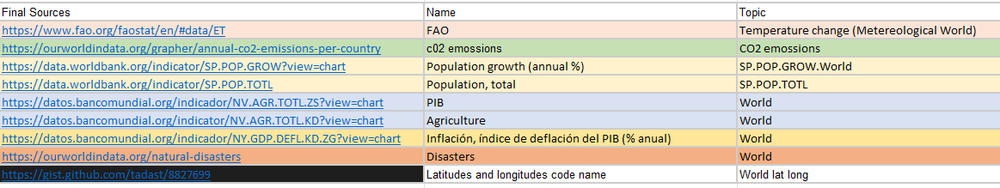
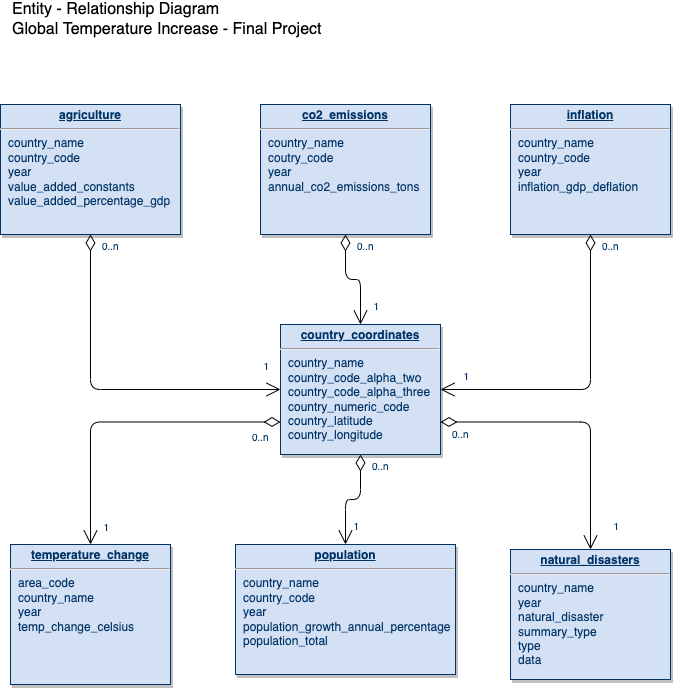

# final_project_global_warming
Data Analytics Bootcamp - Final Project - Team Global Warming

## Selected topic 
The cost of weather increase and natural disasters- worldwide view
 Keywords: Earth temperature – natural disasters - cost

## Reason why they selected their topic 

Weather seems to behave lately in an erratic and new way that we are yet to understand.
Extreme temperatures and natural disasters might impact huge populations and world economic sectors.
A variety of aspects need to be taken into consideration with this new weather behavior (individually and business/enterprise wise). 

In the following project, we want to try at the very least to provide a clearer understanding of available data and identify statistically significant variables that might be implicated in this complex and evolving worldwide situation. This may provide a light and hopefully offer not only information but also a predictive model that may be the stepping stone of decision making for different enterprises or sectors. 

## Project Outline
- Objective 
We want to analyze and understand how global warming reflected in temperature change, that has been reported to take place around the world, may influence the occurrence of natural disasters and how these implications may impact in business and the economy. 

Our aim is first, using net available data sources, to provide visualization of temperature change around the globe (per country) from 1970 to 2020 along with natural disasters occurrence. Other available variables will be also mapped out, that seem to be associated like: CO2 emissions and population count, and mortality associated with natural disasters. 

Second, Using this information, to identify hard variables that may help detect danger zones. We want to find the most affected/vulnerable countries (using mortality and gdp inflation and deflation rate) and create a model trying to find if there is a correlation between these variables or which variables seem to have a higher impact. 

Lastly, we want to try to create a predictive model that may forecast the impact of global warming, natural disasters outcomes in mortality and the economy related variables that may provide important insight to different business and enterprises in decision making or light up red lights that make a call for back-up plans for their survival.  

- Questions we hope to answer with the data
Is there a correlation between the increase of temperature world wide and the number of natural disasters?
Which countries are mostly affected by these variables during the time period 1970 to 2020? 
What is the (economic*****?) impact of these variables in sectors like enterprises or governments?

## Communication protocols
GitHub and Slack

## Description of their source of data (preview plan)
- Project design 
Technologies and tools: Pandas, Python, Jupyter notebook, PostgreSQL  JavaScript, Mapbox, Tableau, (Libraries: seaborn, matplot?, ) 

### Data clean up and final database creaiton creation
For this project freely available, data sources were searched to obtain data sets of quantitative variables that might be implicated with global warming and might be of some impact for the model. 

Datasources and webpages that asked for payment as well as had poor quality or incomplete data for the time period were excluded. 

Datasets, sources and topics are listed in the table below:

- Data sources: A total of eight raw datasets were obtained for the following project from different data sources. For the ETL process, it was important that all chosen datasets had a key-value that could be linked with one another. 

Data sources list: 
https://www.fao.org/faostat/en/#data/ET
https://ourworldindata.org/grapher/annual-co2-emissions-per-country
https://data.worldbank.org/indicator/SP.POP.GROW?view=chart
https://data.worldbank.org/indicator/SP.POP.TOTL
https://ourworldindata.org/natural-disasters
https://datos.bancomundial.org/indicador/NV.AGR.TOTL.ZS?view=chart
https://gist.github.com/tadast/8827699

- Datasets: 
A total of eight raw datasets were cleaned using python. Unnecessary columns were dropped and incomplete data or extra out of time range data was erased. Countries that changed name during the time period were homogenized to one common name. (islands dropped****** lo agrego?)

Cleaned data was then loaded into PgAdminSQL service to create queries  and export seven csv files with clean relevant variables. 
The following Entity Relationship Diagram shows the results of this work.     

As seen in the following image Catalog and abbreviation index was the main key to merge all datasets using for most of them country code to relate one another. Natural disasters dataset however did not have that key, thus the country name was used to relate with the others.   

### Visualization
For the first objective of data visualization, a dashboard using Javascript and Mapbox API as well as graphs using matplot will be used.

- 
Welcome page featuring introduction to the problematic where the project was born visually enhancing the story. It will include links to rest of dashboards telling the story![image]

- 
Interactive map featuring dataset worldwide information using  interactive and filter able layers of information

- 
Further exploration using tables enabling interactive filtering of dataset.

### Logistic regression Model for vulnerable countries
Tools: Python Jupyter notebook 

### Machine learning model for predictions
Tools: R and Python 
Functions for linear regressions. They will be made for each selected country.
Temperature = f (Co2, P opulation)
Disasters = f (T emperature)
EconomicCosts = f (Disasters)

- Preliminary data preprocessing:
"Vulnerable" countries were selected accoring to economy reports. 
https://germanwatch.org/sites/default/files/Resumen%20Indice%20de%20Riesgo%20Clim%C3%A1tico%20Global%202021.pdf
Inclusion criteria 
Exclusion criteria

- Preliminary feature engineering and feature selection. Decision making process:

- Data split into training and testing sets

- Explanation of model choice, limitations and benefits

### Telling the story
Tableau will be used to create a story to share our project. 

